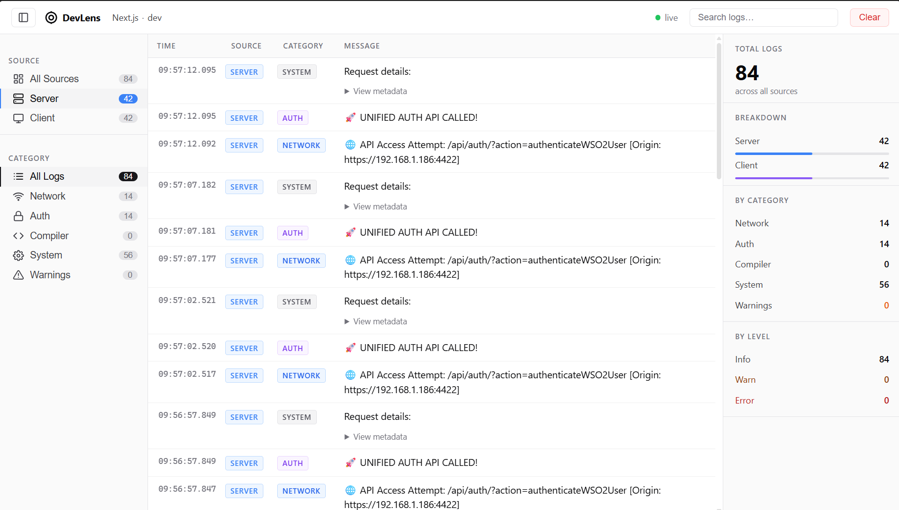

# next-devlens

A real-time structured log dashboard for Next.js development. Intercepts `console.log`, `console.error`, and `console.warn` on both the server and browser, streams them to a local dashboard, and displays them with filtering, search, and source tagging.



---

## Features

- **Live log streaming** via Server-Sent Events (SSE)
- **Compact & Collapsible Sidebar**: Toggle between a full-width filter panel and a space-saving icon-only view
- **Copy Metadata**: Easily copy structured JSON payload to clipboard with a one-click copy button
- **Separate Server & Client Tabs**: Easily filter messages by execution environment
- **Structured Categories**: Filter logs by Network, Auth, Compiler, System, or Warnings
- **Full-text search** across all log messages
- **Visual Styling**: Color-coded error rows, warnings count highlights, and status indicators
- **Deduplication**: Duplicate consecutive logs are grouped together with a repeat badge count
- **Reading Pause**: Automatically pauses live scrolling when viewing older logs
- **Zero-config Fallbacks**: Automatic reconnection and error catching

---

## Installation

### As a local file dependency (monorepo)

In your Next.js app's `package.json`:

```json
{
  "dependencies": {
    "next-devlens": "https://github.com/yibeltal-gashaw/next-devlens.git"
  }
}
```

Then install:

```bash
npm install
```

### From npm (when published)

```bash
npm install next-devlens --save-dev
```

---

## Setup

### 1. Start the dashboard

Run this in a separate terminal before starting your Next.js app:

```bash
npx devlens-dashboard
```

Or add it to your `package.json` dev script alongside your server:

```json
{
  "scripts": {
    "dev": "concurrently -k -n \"Server,DevLens\" -c \"bgBlue,bgMagenta\" \"node server.js\" \"npx devlens-dashboard\""
  }
}
```

Dashboard runs at **http://localhost:4321**.

---

### 2. Wire up server-side logging

In your custom `server.js`, call `initDevLens()` **before** `app.prepare()`:

```js
const { initDevLens } = require('next-devlens');

initDevLens(); // must be called before next() boots

const next = require('next');
const app = next({ dev: true });

app.prepare().then(() => {
  // your server setup
});
```

This patches `console.log` and `console.error` on the Node.js process so all server-side logs are forwarded to the dashboard.

---

### 3. Wire up client-side logging

#### HTTP apps (localhost)

In `pages/_app.js` or `pages/_app.tsx`:

```js
import { initDevLensClient } from 'next-devlens/src/client.js';

initDevLensClient(); // default relayUrl: http://localhost:4321/api/ingest

function MyApp({ Component, pageProps }) {
  return <Component {...pageProps} />;
}

export default MyApp;
```

#### HTTPS apps or remote dev servers

Browsers block direct `fetch` calls from HTTPS pages to HTTP endpoints (mixed content). Use the relay route instead.

**Step 1 — Create `pages/api/devlens-relay.js`** in your Next.js app:

```js
export default async function handler(req, res) {
  if (req.method !== 'POST') return res.status(405).end();
  try {
    await fetch('http://localhost:4321/api/ingest', {
      method: 'POST',
      headers: { 'Content-Type': 'application/json' },
      body: JSON.stringify(req.body),
    });
  } catch (_) {}
  res.status(200).json({ ok: true });
}
```

**Step 2 — Pass `relayUrl` in `_app.js`:**

```js
import { initDevLensClient } from 'next-devlens/src/client.js';

initDevLensClient({ relayUrl: '/api/devlens-relay' });

function MyApp({ Component, pageProps }) {
  return <Component {...pageProps} />;
}

export default MyApp;
```

#### App Router (`app/layout.js`)

```js
'use client';
import { useEffect } from 'react';
import { initDevLensClient } from 'next-devlens/src/client.js';

export default function RootLayout({ children }) {
  useEffect(() => {
    initDevLensClient({ relayUrl: '/api/devlens-relay' });
  }, []);

  return (
    <html>
      <body>{children}</body>
    </html>
  );
}
```

---

## How it works

```
Next.js server (Node.js)
  └── initDevLens() patches console.log/error
        └── http POST → localhost:4321/api/ingest
              └── SSE broadcast → dashboard UI

Browser (client components)
  └── initDevLensClient() patches console.log/error/warn
        └── fetch POST → /api/devlens-relay  (same-origin HTTPS)
              └── server-side relay → localhost:4321/api/ingest
                    └── SSE broadcast → dashboard UI
```

---

## Dashboard

Open **http://localhost:4321** in your browser while your Next.js app is running.

### Sidebar filters

| Section | Filter | Description |
|---|---|---|
| Source | All Sources | All logs regardless of origin |
| Source | Server Logs | Logs from Node.js / server-side only |
| Source | Client Logs | Logs from the browser only |
| Category | All Logs | All categories |
| Category | Network | HTTP requests and API calls |
| Category | Auth | Authentication events |
| Category | Compiler | Next.js compilation messages |
| Category | System | General `console.log` output |
| Category | Warnings | Errors and warnings |

Source and category filters compose — e.g. "Server Logs" + "Network" shows only server-side network logs.

### Search

Type in the search box in the header to filter by message text. Combines with active source and category filters.

### Log rows

| Column | Description |
|---|---|
| Timestamp | `HH:MM:SS.mmm` with milliseconds |
| Source | `server` (blue) or `client` (purple) pill |
| Category | Colour-coded category label |
| Message | Log text, with expandable JSON metadata below |

- **Red left border + tinted row** — error level log
- **×N badge** — repeated consecutive identical message, collapsed into one row
- **▶ View metadata** — click to expand structured object data

---

## API

### `initDevLens()`

Call in `server.js` before `app.prepare()`. No options.

Patches `console.log` and `console.error` on the Node.js process and forwards all output to the dashboard ingest endpoint at `http://localhost:4321/api/ingest`.

Does nothing if `NODE_ENV === 'production'`.

---

### `initDevLensClient(options?)`

Call in `_app.js` or the App Router root layout. Browser-only — safe to import in any client file.

| Option | Type | Default | Description |
|---|---|---|---|
| `relayUrl` | `string` | `'http://localhost:4321/api/ingest'` | Endpoint to POST logs to. Use `'/api/devlens-relay'` for HTTPS apps. |

Patches `console.log`, `console.error`, and `console.warn`. Also captures `window.onerror` and `unhandledrejection` events.

Does nothing if `NODE_ENV === 'production'` or if already initialised (safe across HMR reloads).

---

## Dashboard server endpoints

| Endpoint | Method | Description |
|---|---|---|
| `/` | GET | Dashboard HTML UI |
| `/api/ingest` | POST | Receives a log payload and broadcasts it to all connected dashboard tabs |
| `/stream` | GET | SSE stream — the dashboard subscribes here for live updates |

### Ingest payload shape

```json
{
  "level": "info",
  "category": "network",
  "source": "server",
  "msg": "GET /api/users 200",
  "meta": { "userId": 42 },
  "time": "14:23:07.042"
}
```

| Field | Values |
|---|---|
| `level` | `"info"`, `"error"`, `"warn"` |
| `category` | `"network"`, `"auth"`, `"compiler"`, `"system"`, `"warning"` |
| `source` | `"server"`, `"client"` |
| `meta` | Any JSON-serialisable object, or `null` |

---

## Troubleshooting

**No logs in dashboard after starting the app**
- Make sure the dashboard is running first: `npx devlens-dashboard`
- Confirm `initDevLens()` is called before `app.prepare()` in `server.js`
- Try a manual test in your terminal: `curl -X POST http://localhost:4321/api/ingest -H "Content-Type: application/json" -d "{\"level\":\"info\",\"category\":\"system\",\"source\":\"server\",\"msg\":\"test\",\"time\":\"00:00:00.000\"}"`

**No client logs, relay returns 404**
- Check the relay file exists at `pages/api/devlens-relay.js`
- Make sure there is no trailing slash in `relayUrl: '/api/devlens-relay'`

**No client logs, relay returns 200 but nothing in dashboard**
- Run in browser DevTools: `window.__devLensInitialised` — should be `true`
- If `undefined`, `initDevLensClient()` was never called or ran before the page mounted

**Client logs showing in browser console but not dashboard**
- This is the mixed content block. Your app is on HTTPS but the default `relayUrl` points to `http://`. Switch to the relay route as described in the HTTPS setup above.

**Logs appear under wrong category**
- Category detection in `src/index.js` is keyword-based. Edit `processAndTransmit()` to add your own keywords or patterns.
